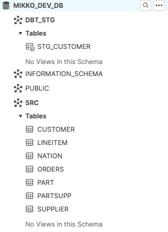

# Business case - Recordly dbt hackathon 4.11.2021

This is the main folder what you should be looking at while doing. This README.md contains instructions for setting up the tooling, connecting to Snowflake, and what you should achieve with dbt during the hackathon.

- [Business case - Recordly dbt hackathon 4.11.2021](#business-case---recordly-dbt-hackathon-4112021)
  - [Business case](#business-case)
    - [Starting a dbt project](#starting-a-dbt-project)
      - [Installing](#installing)
      - [Starting a project](#starting-a-project)
    - [Source system - TPC-H data set](#source-system---tpc-h-data-set)
      - [Source tables - persistent staging managed outside dbt](#source-tables---persistent-staging-managed-outside-dbt)
    - [Planning your dbt project](#planning-your-dbt-project)
    - [Staging](#staging)
    - [Transform](#transform)
    - [Seed files](#seed-files)
    - [Publish](#publish)
      - [Grants for end users](#grants-for-end-users)
    - [Documentation](#documentation)
    - [Running to prod](#running-to-prod)
    - [Expanding on what we did, and other nice stuff to mention](#expanding-on-what-we-did-and-other-nice-stuff-to-mention)
      - [Macros, hooks](#macros-hooks)
      - [Packages](#packages)
      - [Exposures](#exposures)
      - [Analyses](#analyses)
    - [Running dbt in production](#running-dbt-in-production)

## Business case

> Your task is to create well documented and tested data sets from the TPC-H data set. A persistent staging is provided.

### Starting a dbt project

#### Installing

**macOS**

While https://github.com/dbt-labs/dbt-snowflake/issues/19 and https://github.com/snowflakedb/snowflake-connector-python/issues/799 are open, we need to install x64 Homebrew and x64 dbt. Sadly. 

*(As of writing this, arm64 dbt seems to be working with the commands we need in this excersise. Your mileage may vary.)*
```bash
# Install Homebrew for x86_64 architecture
# https://soffes.blog/homebrew-on-apple-silicon
arch -x86_64 /bin/bash -c "$(curl -fsSL https://raw.githubusercontent.com/Homebrew/install/master/install.sh)"

# Make life a little easier for you. Add aliases to ~/.zshrc
alias ibrew='arch -x86_64 /usr/local/bin/brew'
# Refresh
source ~/.zshrc

# Install dbt using that version of Homebrew
ibrew tap dbt-labs/dbt
ibrew install dbt-snowflake

# A nice alias for you
alias idbt='arch -x86_64 /usr/local/bin/dbt'
# Refresh
source ~/.zshrc

idbt --version
installed version: 0.21.0
   latest version: 0.21.0

Up to date!

Plugins:
  - bigquery: 0.21.0
  - snowflake: 0.21.0
  - redshift: 0.21.0
  - postgres: 0.21.0
```
Great success!

**Windows / Python / Container**

Python >= 3.6
```bash
<use a virtual environment>
pyenv install 3.8.12
pyenv virtualenv 3.8.12 dbt_hackathon_env
pyenv activate dbt_hackathon_env
pip install dbt
(OR dbt-snowflake)
dbt --version
```

#### Starting a project

```
cd / mkdir to the root, where you'd like to create [project-name] folder for dbt project and files.

dbt init [project-name] --adapter snowflake
```
The --adapter flag is optional. It will create a correct template in your ~/.dbt/profiles.yml

```
profiles.yml
```

**profiles.yml** contains the information on how all of your dbt projects connect to their target databases. By default, ALL dbt projects will store their profiles in the same ~/.dbt/profiles.yml file.

You can specify a different place for your profiles.yml file.

You can populate the values in profiles.yml from ENV variables.

https://docs.getdbt.com/dbt-cli/configure-your-profile
https://docs.getdbt.com/reference/profiles.yml

```
code ~/.dbt/profiles.yml
```
```yml
profile_name_you_use_in_dbt_project.yml:
  target: dev
  outputs:
    dev:
      type: snowflake
      account: [account id]

      # User/password auth
      user: [username]
      password: [password]

      role: [user role]
      database: [database name]
      warehouse: [warehouse name]
      schema: [dbt schema]
      threads: [1 or more]
      client_session_keep_alive: False
      query_tag: [anything]
```

**Input your DEV DB info. Check Slack for account/username/passowrd info**

```
dbt_project.yml
```

Full reference: https://docs.getdbt.com/reference/dbt_project.yml

dbt_project.yml is the place for configuring your project. For now, we are interested in the the ```profile: ``` part at the top. Change it to what you named your profile in ```~/.dbt/profiles.yml```.

**Congrats! You should now be able to connect to the database!** Let's test it out!

```bash
cd <where_dbt_project.yml is located>
dbt debug
```
If everything is working, you should see the following:
```bash
❯ dbt debug
Running with dbt=0.21.0
dbt version: 0.21.0
python version: 3.8.12
python path: /usr/local/Cellar/dbt/0.21.0_1/libexec/bin/python3
os info: macOS-11.6-x86_64-i386-64bit
Using profiles.yml file at /Users/mikko.sulonen/.dbt/profiles.yml
Using dbt_project.yml file at /Users/mikko.sulonen/src/hackathon/dbt_hackathon/finished/dbt_hackathon/dbt_project.yml

Configuration:
  profiles.yml file [OK found and valid]
  dbt_project.yml file [OK found and valid]

Required dependencies:
 - git [OK found]

Connection:
  account: nnnn.west-europe.azure
  user: nnn
  database: nnn
  schema: dbt
  warehouse: compute_wh
  role: sysadmin
  client_session_keep_alive: False
  Connection test: [OK connection ok]

All checks passed!
```

💪

### Source system - TPC-H data set

Our source data, which is already nicely provided in the src schema in your database, is based on the TPC-H data set.


#### Source tables - persistent staging managed outside dbt

As dbt only manages the transforms, these source tables should be managed outside of the dbt project. As dbt is also designed so that you should always be able to rebuild your complete warehouse, you need to figure out a way to provide a persistent staging for your dbt project.

**Source table SQLs for reference**

Pardon the postgres-Snowflake-SQL-mix.

You might notice that ```src.region``` is commented out and not created in the src schema. We'll get to that later.

```sql
CREATE OR REPLACE TABLE src.nation
(
    n_nationkey  INTEGER ,
    n_name       VARCHAR(500) ,
    n_regionkey  INTEGER ,
    n_comment    VARCHAR(500)
);

/*
CREATE OR REPLACE TABLE src.region
(
    r_regionkey  INTEGER ,
    r_name       VARCHAR(500) ,
    r_comment    VARCHAR(500)
);*/

CREATE OR REPLACE TABLE src.part
(
    p_partkey     BIGINT ,
    p_name        VARCHAR(500) ,
    p_mfgr        VARCHAR(500) ,
    p_brand       VARCHAR(500) ,
    p_type        VARCHAR(500) ,
    p_size        INTEGER ,
    p_container   VARCHAR(500) ,
    p_retailprice FLOAT ,
    p_comment     VARCHAR(500) 
);

CREATE OR REPLACE TABLE src.supplier
(
    s_suppkey     BIGINT ,
    s_name        VARCHAR(500) ,
    s_address     VARCHAR(500) ,
    s_nationkey   INTEGER ,
    s_phone       VARCHAR(500) ,
    s_acctbal     float ,
    s_comment     VARCHAR(500) 
);

CREATE OR REPLACE TABLE src.partsupp
(
    ps_partkey     BIGINT ,
    ps_suppkey     BIGINT ,
    ps_availqty    BIGINT ,
    ps_supplycost  float  ,
    ps_comment     VARCHAR(500) 
);

CREATE OR REPLACE TABLE src.customer
(
    c_custkey     BIGINT ,
    c_name        VARCHAR(500) ,
    c_address     VARCHAR(500) ,
    c_nationkey   INTEGER ,
    c_phone       VARCHAR(500) ,
    c_acctbal     FLOAT   ,
    c_mktsegment  VARCHAR(500) ,
    c_comment     VARCHAR(500) 
);

CREATE OR REPLACE TABLE src.orders
(
    o_orderkey       BIGINT ,
    o_custkey        BIGINT ,
    o_orderstatus    VARCHAR(500) ,
    o_totalprice     FLOAT ,
    o_orderdate      DATE ,
    o_orderpriority  VARCHAR(500) ,  
    o_clerk          VARCHAR(500) , 
    o_shippriority   INTEGER ,
    o_comment        VARCHAR(500) 
);

CREATE OR REPLACE TABLE src.lineitem
(
    l_orderkey    BIGINT ,
    l_partkey     BIGINT ,
    l_suppkey     BIGINT ,
    l_linenumber  BIGINT ,
    l_quantity    DOUBLE PRECISION ,
    l_extendedprice  DOUBLE PRECISION ,
    l_discount    DOUBLE PRECISION ,
    l_tax         DOUBLE PRECISION ,
    l_returnflag  VARCHAR(500) ,
    l_linestatus  VARCHAR(500) ,
    l_shipdate    DATE ,
    l_commitdate  DATE ,
    l_receiptdate DATE ,
    l_shipinstruct VARCHAR(500) ,
    l_shipmode     VARCHAR(500) ,
    l_comment      VARCHAR(500) 
);
```

**Now, dbt needs to know that these source tables, managed outside dbt, exist.** This is achieved via configuring sources. Unlike other models, source are .yml configurations. 

https://docs.getdbt.com/docs/building-a-dbt-project/using-sources

>Sources are defined in .yml files in your models directory (as defined by the source-paths config), nested under a sources: key.

Your ```dbt_project.yml``` file contains the source-path config. By default, it is in the ```models/``` path and any subdirectory.

**Let's create a new source definition!**

```models/sources.yml```

```yml
version: 2

sources:
  - name: tpc
    schema: src
    tables:
      - name: customer
      - name: lineitem
      - name: nation
      - name: orders
      - name: part
      - name: partsupp
      - name: supplier
```

The source and table names will be used later in the jinja-sql syntax:
```sql
select
  ...
from {{ source('tpc', 'orders') }}
```

**Notes:**
* Funky table/column naming?
  * ```identifier```: https://docs.getdbt.com/docs/building-a-dbt-project/using-sources#faqs
* Easily testing source freshness
  * https://docs.getdbt.com/docs/building-a-dbt-project/using-sources#snapshotting-source-data-freshness
* Table / column tests just like any other model. We'll be doing tests later.

### Planning your dbt project

In general, your dbt project will have the following functionalities / stages in your datawarehouse:
* persistent staging / source data (outside dbt)
* staging (dbt)
* transform (dbt)
* publish (dbt)

There can be multiple stages in each one. For example, transforming POS sales from the raw data can be tedious. It can be much simpler to do it in multiple parts and not in one giant many-hundred-lines-long.sql transformation.

In this excersice, we'll follow the above:
* Staging
  * Consistent naming
  * Creating keys if necessary
  * Adding metadata columns
    * dbt_load_time for example
  * Tests for new data
* Transform
  * Implementing business logic and rules. The usual data stuff. Making the raw data make sense.
  * Tests for successfull transform and data contents. Are the calculated values meaningful?
* Publish
  * Usable datasets.
  * Tested datasets.
  * Documented datasets.
### Staging

This is the first part of the dbt managed datawarehouse. What we want to achieve here is to have a consistent layer on which to build the transformations. This can include:
* Consistent naming
* Consistent timestamps / date formats
* Removing duplicates

In dbt language these requirements translate to basically two options:
* Incremental models
* Snapshots

**Incremental models**

https://docs.getdbt.com/docs/building-a-dbt-project/building-models/configuring-incremental-models

tl;dr is you define filter on which to limit the number of rows to transform on each run ("where source_date > target_date"). And also most probably a unique identifier for each row.

**Snapshots**

Type 2 slowly changing dimension. Possible to detect hard deletes for example.

https://docs.getdbt.com/docs/building-a-dbt-project/snapshots

There are some design considerations with snapshots: target schema, running it as a part of workflow, etc. 

**We'll proceed with normal tables and/or incremental models**

Let's create dbt managed staging tables on-top of our source tables.

models/staging/tpc/stg_customer.sql
```sql
select c_custkey,
    c_name,
    c_address,
    c_nationkey,
    c_phone,
    c_acctbal,   
    c_mktsegment,
    c_comment,
    current_timestamp() as dbt_loaded_at
from {{ source('tpc', 'customer') }}
```
This would result in ```stg_customer``` named what now? View? Table? Let's configure.

Now, in dbt we don't write any ddl such as ```create table as```. **Everything is a select.** The materialization (and clustering for example), are configured elsewhere.

**Configuring models**

https://docs.getdbt.com/reference/model-configs

Configuration hierarchy. Most specific, the lowest number, will always override.
1. Using a config() Jinja macro within a model
2. Using a config resource property in a .yml file
3. From the dbt_project.yml file, under the models: key.

Let's configure our staging to be tables in ```stg``` schema.

```dbt_project.yml```
```yml
name: 'my_new_project' # Change to something meaningful
---
models:
  my_new_project: # Align the naming as above
    # Config indicated by + and applies to all files under models/example/
    # The path here follows the folder paths starting from models/
    staging:
      +schema: stg
      +materialized: view
      tpc:
        +materialized: table
```

And let's delete the example folder and it's contents.

Now we are ready to run something!

```
❯ dbt run
Running with dbt=0.21.0
Found 1 model, 0 tests, 0 snapshots, 0 analyses, 172 macros, 0 operations, 0 seed files, 7 sources, 0 exposures

22:14:37 | Concurrency: 2 threads (target='dev')
22:14:37 | 
22:14:37 | 1 of 1 START table model dbt_stg.stg_customer........................ [RUN]
22:14:42 | 1 of 1 OK created table model dbt_stg.stg_customer................... [SUCCESS 1 in 5.28s]
22:14:42 | 
22:14:42 | Finished running 1 table model in 8.81s.

Completed successfully

Done. PASS=1 WARN=0 ERROR=0 SKIP=0 TOTAL=1
```

This will result in the following:



Few things to note here:
* We configured the staging-folder level to be views
* Below that, a more specific config, we override that config and say in staging/tpc folder everythings is a table.
* Eventhough we stated the schema to be ```stg```, we ended up with ```dbt_stg```. This is by design, and is easily configured. The schema name is concatenated from the ```~/.dbt/profiles.yml``` schema + target schema. https://docs.getdbt.com/docs/building-a-dbt-project/building-models/using-custom-schemas 
* The new table is also populated! ```dbt run``` will not only create the schema, tables and views, it will also load them

Snowflake query history shows what dbt actually did. It queried the information schema (well, in Snowflake it used ```show terse objects```) and then created SQL migrations. The SQL for our table ended up being the following:

```sql
create or replace transient table mikko_dev_db.dbt_stg.stg_customer  as
      (select c_custkey,
    c_name,
    c_address,
    c_nationkey,
    c_phone,
    c_acctbal,   
    c_mktsegment,
    c_comment,
    current_timestamp() as dbt_loaded_at
from mikko_dev_db.src.customer
      );
```

**Create a staging entity for lineitem. But configure it to be a view**

Hint: https://docs.getdbt.com/reference/model-configs and use "Config block". Everything else is a select as with the stg_customer. 

If you need help, [finished project folder](/finished/dbt_hackathon/models/staging/tpc/stg_lineitem.sql) has a working jinja-sql file.

```
❯ dbt run
Running with dbt=0.21.0
Found 2 models, 0 tests, 0 snapshots, 0 analyses, 172 macros, 0 operations, 0 seed files, 7 sources, 0 exposures

22:33:33 | Concurrency: 2 threads (target='dev')
22:33:33 | 
22:33:33 | 1 of 2 START table model mikko_stg.stg_customer...................... [RUN]
22:33:33 | 2 of 2 START view model mikko_stg.stg_lineitem....................... [RUN]
22:33:34 | 2 of 2 OK created view model mikko_stg.stg_lineitem.................. [SUCCESS 1 in 1.25s]
22:33:39 | 1 of 2 OK created table model mikko_stg.stg_customer................. [SUCCESS 1 in 6.21s]
22:33:39 | 
22:33:39 | Finished running 1 view model, 1 table model in 9.82s.

Completed successfully

Done. PASS=2 WARN=0 ERROR=0 SKIP=0 TOTAL=2
```

But now we have a bottleneck. We don't want to keep running a long running table if we didn't make any changes to it. Here's where the ```Node selector``` syntax comes in: https://docs.getdbt.com/reference/node-selection/syntax

```
❯ dbt run --select stg_lineitem
Running with dbt=0.21.0
Found 2 models, 0 tests, 0 snapshots, 0 analyses, 172 macros, 0 operations, 0 seed files, 7 sources, 0 exposures

22:36:12 | Concurrency: 2 threads (target='dev')
22:36:12 | 
22:36:12 | 1 of 1 START view model mikko_stg.stg_lineitem....................... [RUN]
22:36:14 | 1 of 1 OK created view model mikko_stg.stg_lineitem.................. [SUCCESS 1 in 1.19s]
22:36:14 | 
22:36:14 | Finished running 1 view model in 3.76s.

Completed successfully

Done. PASS=1 WARN=0 ERROR=0 SKIP=0 TOTAL=1
```

Now we can quickly run only the parts we want. 

One of the most useful is running all the dependent models after the one we changed: that is easily achieved with a ```+``` sign. 

For example running ```dbt run --select models/staging/tpc+``` would execute all the models from staging/tpc folder and all the models dependent on them.

For automatic CI, there's the topic of state. So you can basically run ```modified+``` for dynamically checking your changes.

https://docs.getdbt.com/docs/guides/best-practices#run-only-modified-models-to-test-changes-slim-ci 

### Transform

This is where you would the business logic, modeling, etc. But for this excercise, we'll skip it.
### Seed files

dbt has a useful command for adding simple reference data from a csv source called "seed"s. https://docs.getdbt.com/docs/building-a-dbt-project/seeds

Seed files shouldn't be used for large data transfer and they are version controlled along with your other project. So they are great for mapping info, reference data etc.

Use reference data from the [region.csv](region.csv) to add a column.
* Copy region.csv to ```data/``` folder
* Add seeds to your ```dbt_project.yml```
  * ```yml
    seeds:
      dbt_hackathon:
      schema: ref
    ```
* ```dbt seed```

```
❯ dbt seed
Running with dbt=0.21.0
Found 2 models, 0 tests, 0 snapshots, 0 analyses, 172 macros, 0 operations, 1 seed file, 7 sources, 0 exposures

23:11:56 | Concurrency: 2 threads (target='dev')
23:11:56 | 
23:11:56 | 1 of 1 START seed file mikko_ref.region.............................. [RUN]
* Deprecation Warning: The quote_columns parameter was not set for seeds, so the
default value of False was chosen. The default will change to True in a future
release.

For more information, see:
https://docs.getdbt.com/v0.15/docs/seeds#section-specify-column-quoting
23:12:00 | 1 of 1 OK loaded seed file mikko_ref.region.......................... [INSERT 5 in 3.62s]
23:12:00 | 
23:12:00 | Finished running 1 seed in 6.86s.

Completed successfully

Done. PASS=1 WARN=0 ERROR=0 SKIP=0 TOTAL=1
```
### Publish

**Create a new customer table in publish schema with data from source-nation and seed-region added**

* Update ```dbt_project.yml``` with schema naming
* Use model specific config block.
* Use ref-syntax! https://docs.getdbt.com/reference/dbt-jinja-functions/ref

**Create publish schema views on all other src-tables**

* Update ```dbt_project.yml``` with materialization being views.

**Create a test for PARTKEY in PART being not null and unique in part-view**

**Create a test for orders containing only existing customers**

https://docs.getdbt.com/docs/building-a-dbt-project/tests


```
❯ dbt test
Running with dbt=0.21.0
Found 8 models, 3 tests, 0 snapshots, 0 analyses, 172 macros, 0 operations, 1 seed file, 7 sources, 0 exposures

09:46:18 | Concurrency: 2 threads (target='dev')
09:46:18 | 
09:46:18 | 1 of 3 START test not_null_part_p_partkey............................ [RUN]
09:46:18 | 2 of 3 START test relationships_orders_o_custkey__c_custkey__ref_customer_ [RUN]
09:46:20 | 1 of 3 PASS not_null_part_p_partkey.................................. [PASS in 2.75s]
09:46:20 | 3 of 3 START test unique_part_p_partkey.............................. [RUN]
09:46:21 | 2 of 3 PASS relationships_orders_o_custkey__c_custkey__ref_customer_. [PASS in 3.16s]
09:46:22 | 3 of 3 PASS unique_part_p_partkey.................................... [PASS in 1.42s]
09:46:22 | 
09:46:22 | Finished running 3 tests in 6.29s.

Completed successfully

Done. PASS=3 WARN=0 ERROR=0 SKIP=0 TOTAL=3
```

Looking at Snowflake query history, we can see what kind of queries are actually generated:

```sql
select
      count(*) as failures,
      count(*) != 0 as should_warn,
      count(*) != 0 as should_error
    from (
      
    
    

with child as (
    select o_custkey as from_field
    from mikko_dev_db.mikko_publish.orders
    where o_custkey is not null
),

parent as (
    select c_custkey as to_field
    from mikko_dev_db.mikko_publish.customer
)

select
    from_field

from child
left join parent
    on child.from_field = parent.to_field

where parent.to_field is null


      
    ) dbt_internal_test
```

#### Grants for end users

Creating publish entities is just one thing. We alos need to make them available for end users / tools. This is where different dbt hooks come into play.

https://docs.getdbt.com/docs/building-a-dbt-project/hooks-operations

* Create a post-hook on publish models to grant select on each model to role ```power_bi_role``` (which is already created in Snowflake).
* Create a post-hook to grant usage on the publish schema.
* Run ```dbt run``` on only publish models to apply grants.
* Verify from Snowflake UI.

### Documentation

**Document data lineage and data sets.**

```
❯ dbt docs generate
Running with dbt=0.21.0
Found 8 models, 3 tests, 0 snapshots, 0 analyses, 172 macros, 0 operations, 1 seed file, 7 sources, 0 exposures

10:26:07 | Concurrency: 2 threads (target='dev')
10:26:07 | 
10:26:07 | Done.
10:26:07 | Building catalog
10:26:09 | Catalog written to /Users/mikko.sulonen/src/hackathon/dbt_hackathon/finished/dbt_hackathon/target/catalog.json
```

```
❯ dbt docs serve
Running with dbt=0.21.0
Serving docs at 0.0.0.0:8080
To access from your browser, navigate to:  http://localhost:8080
Press Ctrl+C to exit.
```

https://docs.getdbt.com/docs/building-a-dbt-project/documentation


### Running to prod

Add a ```prod``` block to ```~/.dbt/profiles.yml```. Same info, but change the db to be nnn_prod_db.

```
❯ dbt build --target prod 
Running with dbt=0.21.0
Found 8 models, 3 tests, 0 snapshots, 0 analyses, 172 macros, 0 operations, 1 seed file, 7 sources, 0 exposures

10:39:20 | Concurrency: 2 threads (target='prod')
10:39:20 | 
10:39:20 | 1 of 12 START view model mikko_publish.orders........................ [RUN]
10:39:20 | 2 of 12 START view model mikko_publish.part.......................... [RUN]
10:39:22 | 1 of 12 OK created view model mikko_publish.orders................... [SUCCESS 1 in 1.62s]
10:39:22 | 3 of 12 START view model mikko_publish.partsupp...................... [RUN]
10:39:22 | 2 of 12 OK created view model mikko_publish.part..................... [SUCCESS 1 in 1.65s]
10:39:22 | 4 of 12 START table model mikko_stg.stg_customer..................... [RUN]
10:39:24 | 3 of 12 OK created view model mikko_publish.partsupp................. [SUCCESS 1 in 1.91s]
10:39:24 | 5 of 12 START view model mikko_stg.stg_lineitem...................... [RUN]
10:39:25 | 5 of 12 OK created view model mikko_stg.stg_lineitem................. [SUCCESS 1 in 1.28s]
10:39:25 | 6 of 12 START view model mikko_publish.supplier...................... [RUN]
10:39:27 | 6 of 12 OK created view model mikko_publish.supplier................. [SUCCESS 1 in 1.67s]
10:39:27 | 7 of 12 START seed file mikko_ref.region............................. [RUN]
* Deprecation Warning: The quote_columns parameter was not set for seeds, so the
default value of False was chosen. The default will change to True in a future
release.

For more information, see:
https://docs.getdbt.com/v0.15/docs/seeds#section-specify-column-quoting
10:39:28 | 4 of 12 OK created table model mikko_stg.stg_customer................ [SUCCESS 1 in 6.26s]
10:39:28 | 8 of 12 START test not_null_part_p_partkey........................... [RUN]
10:39:30 | 7 of 12 OK loaded seed file mikko_ref.region......................... [INSERT 5 in 2.72s]
10:39:30 | 9 of 12 START test unique_part_p_partkey............................. [RUN]
10:39:30 | 8 of 12 PASS not_null_part_p_partkey................................. [PASS in 1.82s]
10:39:30 | 10 of 12 START view model mikko_publish.lineitem..................... [RUN]
10:39:31 | 9 of 12 PASS unique_part_p_partkey................................... [PASS in 1.59s]
10:39:31 | 11 of 12 START table model mikko_publish.customer.................... [RUN]
10:39:32 | 10 of 12 OK created view model mikko_publish.lineitem................ [SUCCESS 1 in 1.72s]
10:39:37 | 11 of 12 OK created table model mikko_publish.customer............... [SUCCESS 1 in 5.52s]
10:39:37 | 12 of 12 START test relationships_orders_o_custkey__c_custkey__ref_customer_ [RUN]
10:39:38 | 12 of 12 PASS relationships_orders_o_custkey__c_custkey__ref_customer_ [PASS in 1.42s]
10:39:38 | 
10:39:38 | Finished running 6 view models, 2 table models, 1 seed, 3 tests in 24.23s.

Completed successfully

Done. PASS=12 WARN=0 ERROR=0 SKIP=0 TOTAL=12
```

Verify from Snowflake.

Congrats! That's it. You just "deployed" everything to prod (given that we already had the same src-tables in place...).

### Expanding on what we did, and other nice stuff to mention
#### Macros, hooks

https://docs.getdbt.com/docs/building-a-dbt-project/jinja-macros

https://github.com/mikkosulonen/dbt_helpers


#### Packages

https://hub.getdbt.com/

https://hub.getdbt.com/dbt-labs/dbt_utils/latest/

https://hub.getdbt.com/dbt-labs/dbt_external_tables/latest/

https://hub.getdbt.com/calogica/dbt_expectations/latest/
#### Exposures

https://docs.getdbt.com/docs/building-a-dbt-project/exposures

#### Analyses

https://docs.getdbt.com/docs/building-a-dbt-project/analyses

### Running dbt in production

This was all about developing with dbt more or less locally. How to run dbt in a project? Discussion.
